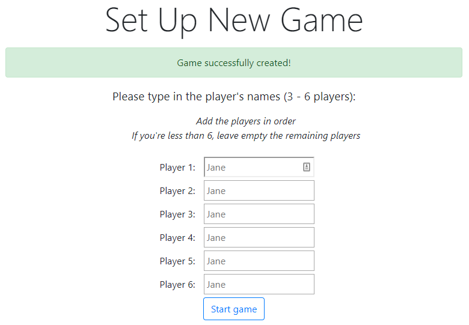
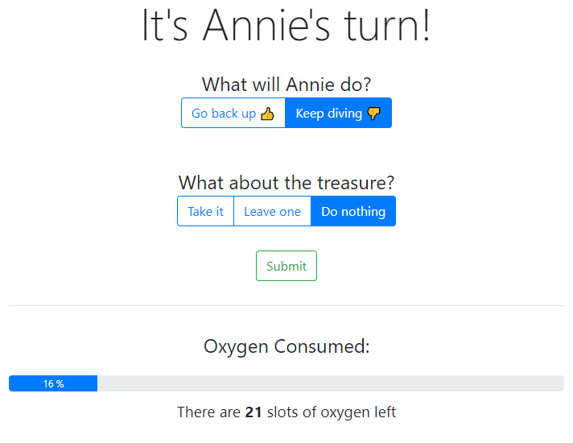
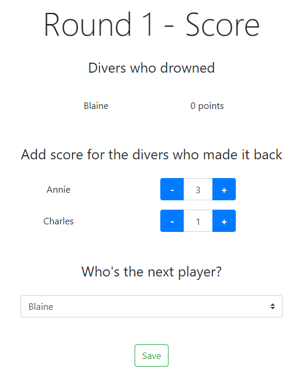
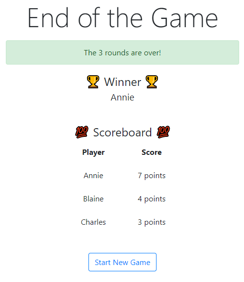

<p align="center">
  
</p>

# Deep Sea Adventures - Scoring App

[](https://travis-ci.com/jsiny/deep_sea_adventure) [](https://coveralls.io/github/jsiny/deep_sea_adventure?branch=master)

This [website](https://deep-sea-adventure.herokuapp.com/) is a **scoring tool**
dedicated to the board game
[Deep Sea Adventure](https://oinkgms.com/en/deep-sea-adventure) edited by
[Oink Games](https://oinkgms.com/en/).

Its goal is to provide players a **reliable way to compute the oxygen decrease**
during a round. It's meant to be used side by side with the board game,
either on a mobile or computer.

## Motivation

I like board games, but dislike arguing with friends over a messy score count.

In Deep Sea Adventure, players dive into the deep ocean looking for 
treasures. All divers share the **same oxygen tank**, and each treasure picked
up weighs down the diver and increases its oxygen intake. All divers must be
back into the submarine before the oxygen tank becomes empty.
[More on the game's rules](https://oinkgms.com/en/deep-sea-adventure)

It is therefore critical to accurately monitor the available oxygen.

However, experience shows that it can be difficult to accurately compute the 
available oxygen in a quick game setup, and that arguments over which player
should have drowned tend to ruin the fun. This is where this Scoring App comes
handy! 

## How To Use

### 1. Create New Game



### 2. Record action for each player



A player can choose to keep diving or go back to the surface. She can also
add a treasure, leave one of hers, or do nothing.

It's now easy to follow the oxygen supply thanks to the progress bar at the
bottom of the page 🌈

### 3. At the end of the round, record the score



### 4. After 3 rounds, crown a winner!



## Tech

Built with Ruby and the framework [Sinatra](http://sinatrarb.com/).
This project uses sessions and cookies storage in order to play a game without
logging in users. 

## Tests

Run one of the following commands to run the test suite:

```ruby
rake
rake default
rake test
```

## Possible Future Improvements

* Allow users to edit a previously submitted action
* Allow users to customize the number of rounds for a game
* Allow users to log in and save their games for future references

## Credit

This project is the work of [Juliette Sinibardy](https://jsinibardy.com)